# Linux Agent 운영 환경 구축 및 관제 자동화

Ubuntu 22.04 환경에 다중 사용자 권한 체계, SSH·방화벽 보안, 애플리케이션 실행 환경을 구성하고 Bash·cron·logrotate로 상태 관제와 로그 보존을 자동화한 프로젝트입니다.

> **검증 결과:** 자동 검증 `PASS=21, FAIL=0` · Boot Sequence 5단계 통과 · 정상 관제 로그 누적 · 프로세스 중단 시 `exit 1`

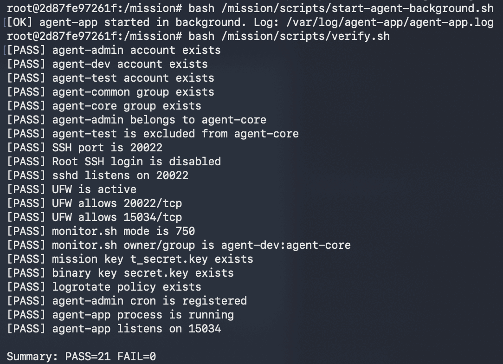

## 프로젝트 목표

단순히 리눅스 명령어를 실행하는 데 그치지 않고, 실제 서버 운영 흐름을 기준으로 다음 항목을 설계했습니다.

- 역할별 계정·그룹과 ACL을 이용한 공유 영역/보안 영역 분리
- SSH 진입 경로와 인바운드 포트를 최소화한 네트워크 보안
- 일반 계정 기반 애플리케이션 실행과 환경 변수 표준화
- 프로세스·포트 Health Check 및 CPU/MEM/DISK 관제
- 장애와 경고를 분리한 종료 코드 정책
- cron 기반 주기 실행과 logrotate 기반 로그 용량 관리

## 요구사항 충족 현황

| 평가 항목 | 구현 내용 | 검증 결과 |
|---|---|---|
| SSH 보안 | 포트 `20022`, `PermitRootLogin no` | [SSH 설정](#1-ssh-보안) |
| 방화벽 | UFW 활성화, 기본 인바운드 차단, `20022/tcp`·`15034/tcp`만 허용 | [UFW 규칙](#2-ufw-방화벽) |
| 계정·그룹 | `agent-admin/dev/test`, `agent-common/core` 구성 | [계정·그룹](#3-계정그룹과-최소-권한) |
| 앱 실행 | `agent-admin`으로 실행, Boot Sequence 5단계 `[OK]`, `Agent READY` | [앱 기동](#4-애플리케이션-기동) |
| Health Check | `agent-app` 프로세스와 TCP `15034` LISTEN 상태를 각각 검사 | [정상 관제](#5-관제로그cron) |
| 장애 처리 | 프로세스 또는 포트 비정상 시 즉시 `exit 1` | [실패 검증](#7-비정상-상태-검증) |
| 로그 누적 | 지정 포맷으로 `/var/log/agent-app/monitor.log`에 `>>` 누적 | [로그 누적](#5-관제로그cron) |
| 자동 실행 | `agent-admin` crontab에서 `monitor.sh`를 매분 실행 | [cron 증가](#5-관제로그cron) |
| 로그 용량 관리 | `size 10M`, `rotate 10`, 압축, `copytruncate` | [logrotate](#6-logrotate) |
| 전체 자동 검증 | 계정·보안·권한·앱·포트·cron 등 21개 항목 검사 | `PASS=21`, `FAIL=0` |

## 동작 구조

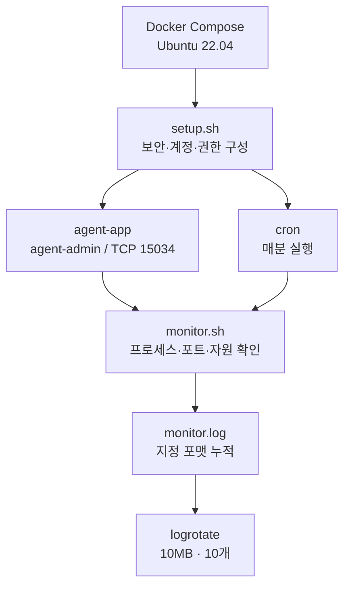

## 저장소 구조

```text
.
├── agent-app/
│   ├── agent-app-linux-x86
│   └── agent-app-linux-arm64
├── config/
│   └── agent-app.logrotate
├── docs/
│   └── evidence/                  # 수행 검증 이미지
├── scripts/
│   ├── container-entrypoint.sh
│   ├── setup.sh                   # 계정·권한·SSH·UFW·cron 일괄 구성
│   ├── start-agent.sh
│   ├── start-agent-background.sh
│   ├── stop-agent.sh
│   ├── test-monitor-failure.sh
│   └── verify.sh                  # 요구사항 자동 검증
├── src/
│   ├── monitor.sh                 # Health Check와 자원 관제
│   └── report.sh                  # 누적 로그 통계(보너스)
├── Dockerfile
├── docker-compose.yml
└── README.md
```

## 실행 방법

### 1. 컨테이너 실행

```bash
docker compose up -d --build
docker exec -it agent-linux bash
```

### 2. 운영 환경 구성

컨테이너 내부에서 root로 실행합니다.

```bash
bash /mission/scripts/setup.sh
```

`setup.sh`는 계정·그룹 생성, 디렉토리·ACL 적용, CPU 아키텍처별 바이너리 설치, 키·로그 파일 생성, SSH·UFW·logrotate·cron 구성을 순서대로 수행합니다.

### 3. 앱 실행

Boot Sequence를 직접 확인하려면 포그라운드로 실행합니다.

```bash
bash /mission/scripts/start-agent.sh
```

검증을 계속하려면 `Ctrl+C`로 종료한 뒤 백그라운드로 실행합니다.

```bash
bash /mission/scripts/start-agent-background.sh
```

### 4. 관제 및 전체 검증

```bash
sudo -u agent-admin /home/agent-admin/agent-app/bin/monitor.sh
echo "monitor_exit=$?"

bash /mission/scripts/verify.sh
```

정상 상태에서 `monitor.sh`는 `exit 0`, `verify.sh`는 `PASS=21 FAIL=0`을 반환합니다.

### 5. 실패 상태 검증

```bash
bash /mission/scripts/stop-agent.sh
bash /mission/scripts/test-monitor-failure.sh
```

테스트 스크립트는 중단된 프로세스에 대해 `monitor.sh`가 `exit 1`을 반환하는지 확인합니다.

## 설계 및 구현

### 계정·그룹과 최소 권한

| 대상 | 소유자:그룹 | 권한 | 접근 정책 |
|---|---|---:|---|
| `upload_files` | `agent-admin:agent-common` | `2770` | admin/dev/test 읽기·쓰기 |
| `api_keys` | `agent-admin:agent-core` | `2770` | admin/dev만 읽기·쓰기 |
| `/var/log/agent-app` | `agent-admin:agent-core` | `2770` | admin/dev만 읽기·쓰기 |
| `agent-app` | `agent-admin:agent-core` | `750` | 운영 계정 실행 |
| `monitor.sh` | `agent-dev:agent-core` | `750` | dev 소유, admin이 cron으로 실행 |

`agent-test`에는 파일 업로드에 필요한 `agent-common` 권한만 부여하고, API 키와 운영 로그에 접근할 수 있는 `agent-core`에서는 제외했습니다. 디렉토리에는 setgid와 기본 ACL을 적용해 새 파일도 상위 디렉토리의 협업 그룹과 권한 정책을 상속합니다.

### 애플리케이션 실행 환경

| 환경 변수 | 값 |
|---|---|
| `AGENT_HOME` | `/home/agent-admin/agent-app` |
| `AGENT_PORT` | `15034` |
| `AGENT_UPLOAD_DIR` | `/home/agent-admin/agent-app/upload_files` |
| `AGENT_KEY_PATH` | `/home/agent-admin/agent-app/api_keys` |
| `AGENT_LOG_DIR` | `/var/log/agent-app` |

제공된 바이너리를 직접 검증한 결과, 미션 문서의 `t_secret.key` 파일 경로와 달리 실행 파일은 `AGENT_KEY_PATH`에 디렉토리를 요구하고 내부의 `secret.key`를 읽었습니다. 문서 요구와 실제 실행 조건을 모두 만족하도록 동일한 테스트 값의 `t_secret.key`와 `secret.key`를 생성했습니다.

앱은 root가 아닌 `agent-admin`으로 실행합니다. 실행 경로와 포트를 환경 변수로 고정해 포그라운드 실행, 백그라운드 실행, cron처럼 호출 환경이 달라도 동일한 구성을 사용하도록 했습니다.

### `monitor.sh` Health Check

#### 프로세스 확인

```bash
pgrep -o -u agent-admin -x agent-app
```

- `pgrep`는 `ps | grep`보다 PID 검색 목적이 명확하고 grep 프로세스가 결과에 섞이지 않습니다.
- `-u`로 실행 계정을 제한하고 `-x`로 프로세스 이름 전체가 일치할 때만 통과시킵니다.
- 패키징된 앱에서 PID가 복수로 나타날 수 있어 `-o`로 가장 오래된 대표 PID를 기록합니다.

#### 포트 확인

```bash
ss -ltnH
```

프로세스가 존재해도 포트 바인딩에 실패할 수 있으므로 실제 TCP LISTEN 소켓을 별도로 검사합니다. `ss`는 현재 리눅스에서 기본적으로 제공되며, 구형 `net-tools`의 `netstat`에 의존하지 않습니다.

#### 자원 수집

| 지표 | 수집 방식 | 경고 임계값 |
|---|---|---:|
| CPU | `/proc/stat`을 1초 간격으로 두 번 읽고 전체/idle 변화량 계산 | `> 20%` |
| MEM | `/proc/meminfo`의 `MemTotal`·`MemAvailable`로 사용률 계산 | `> 10%` |
| DISK | `df -P /`에서 루트 파티션 Used `%` 추출 | `> 80%` |

로그는 사람이 `tail`로 읽기 쉽고 `awk`로도 안정적으로 파싱할 수 있도록 한 줄의 고정된 `KEY:VALUE` 형식으로 기록합니다.

```text
[YYYY-MM-DD HH:MM:SS] PID:... CPU:..% MEM:..% DISK_USED:..%
```

#### 종료 정책

- 앱 프로세스 또는 포트 비정상: 서비스를 제공할 수 없는 상태이므로 `exit 1`
- UFW 비활성·조회 실패 또는 자원 임계값 초과: 관측 가능한 이상 징후이므로 `[WARNING]` 출력 후 로그를 남기고 `exit 0`

이렇게 장애와 경고를 분리하면 일시적인 자원 상승으로 모니터링 작업 자체가 중단되는 것을 막으면서, 실제 서비스 불가 상태는 상위 자동화가 실패로 인식할 수 있습니다.

### 로그 누적과 보존

`monitor.sh`는 다음과 같이 `>>`로 로그를 추가합니다.

```bash
printf '%s\n' "$LOG_LINE" >> "$LOG_FILE"
```

`>`는 파일을 매번 덮어쓰지만 `>>`는 기존 로그 뒤에 새 기록을 추가합니다. 장애 전후의 변화와 반복 패턴을 추적하려면 시계열 기록이 보존되어야 하므로 누적 리다이렉션이 필요합니다.

`agent-admin`의 crontab은 매분 관제를 실행합니다.

```cron
* * * * * /home/agent-admin/agent-app/bin/monitor.sh >> /var/log/agent-app/cron.log 2>&1
```

`monitor.log`는 logrotate로 10MB를 넘을 때 회전하고 이전 파일 10개를 유지합니다. 오래된 파일은 압축하며, 실행 중인 프로세스가 같은 파일 디스크립터를 계속 사용해도 기록이 끊기지 않도록 `copytruncate`를 적용했습니다.

## 수행 검증

### 1. SSH 보안

유효 설정에서 SSH 포트 `20022`와 Root 원격 로그인 차단을 확인했습니다.

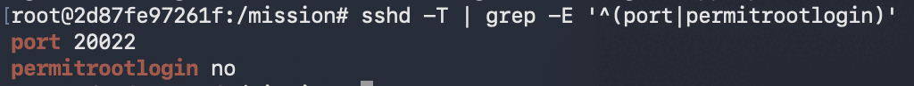

### 2. UFW 방화벽

UFW가 `active`이고 기본 인바운드는 차단되며, IPv4/IPv6 모두 `20022/tcp`와 `15034/tcp`만 허용됩니다.

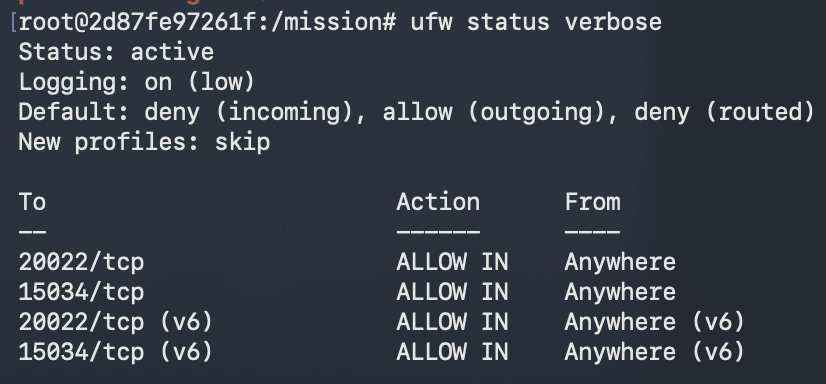

### 3. 계정·그룹과 최소 권한

`agent-admin`은 `agent-common`·`agent-core`에 포함되고, `agent-test`는 `agent-common`에만 포함되어 보안 그룹에서 제외됩니다.

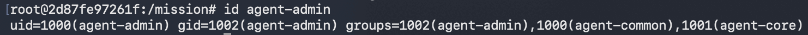

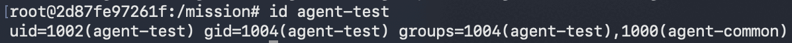

### 4. 애플리케이션 기동

Boot Sequence 5단계가 모두 `[OK]`를 통과하고 `Agent READY`, TCP `15034` 리슨을 확인했습니다.

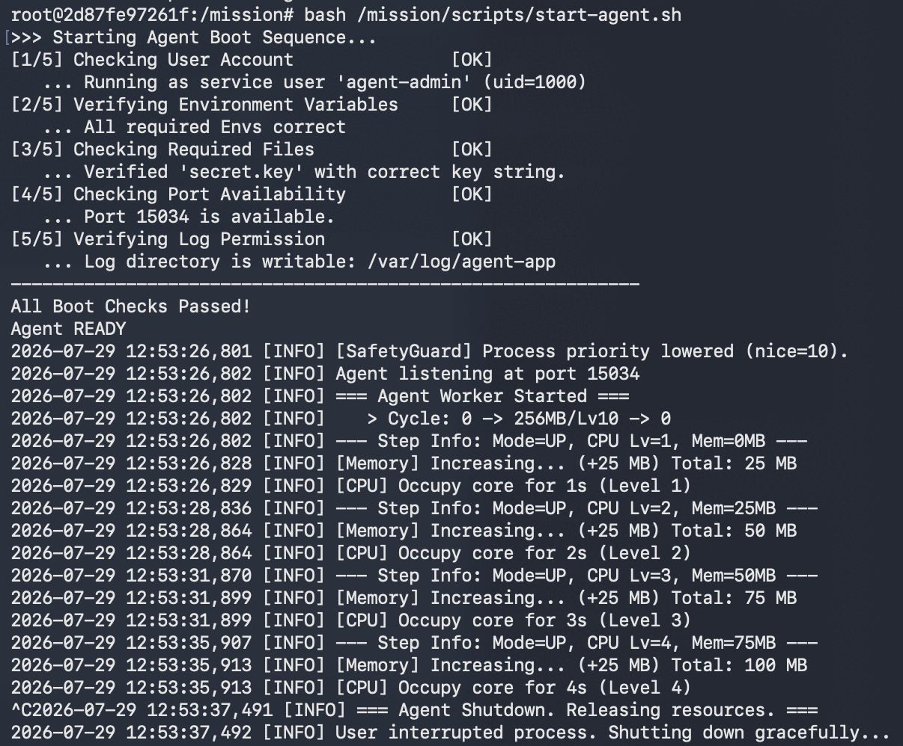

### 5. 관제·로그·cron

프로세스, TCP `15034`, UFW 상태가 모두 정상이며 CPU/MEM/DISK 값을 수집해 지정 포맷으로 누적했습니다.

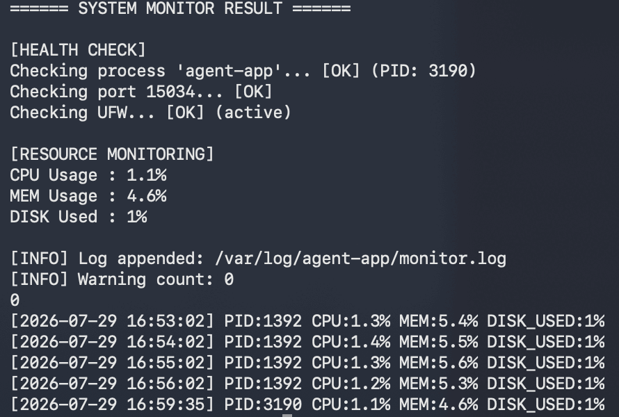

cron 등록 후 `monitor.log` 라인 수가 `63`에서 `64`로 증가해 매분 자동 실행을 확인했습니다.

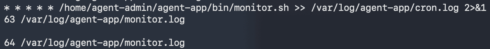

### 6. logrotate

`monitor.log`에 `size 10M`, `rotate 10`, 압축, `copytruncate`, 소유자·그룹 정책을 적용했습니다.

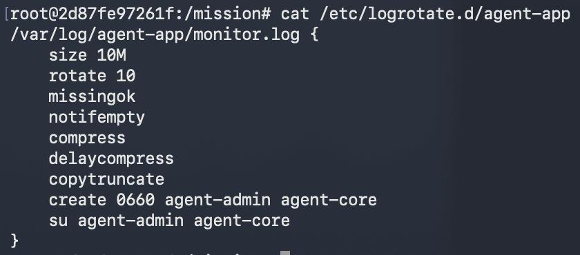

### 7. 비정상 상태 검증

앱 중단 상태에서 `monitor.sh`가 프로세스 비정상을 감지하고 `exit 1`로 종료됨을 확인했습니다.

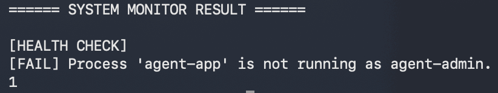

### 8. 환경 구성 자동화

Docker Compose 빌드·실행과 `setup.sh` 9단계 구성을 완료했습니다.

<details>
<summary>Docker Compose 빌드 결과</summary>

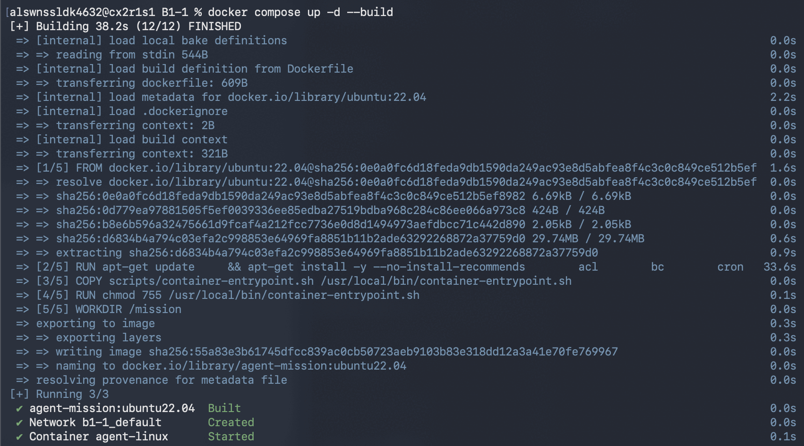

</details>

<details>
<summary>setup.sh 실행 결과</summary>

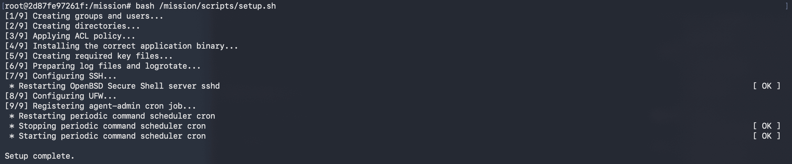

</details>

## 운영 관점의 판단

### SSH 포트 변경과 Root 로그인 차단

SSH 포트 변경은 기본 22번 포트를 대상으로 하는 자동 스캔과 무차별 대입 시도를 줄이는 보조 통제입니다. 이것만으로 인증 보안이 완성되지는 않지만 불필요한 노출과 로그 잡음을 줄일 수 있습니다. Root 원격 로그인을 차단하면 최고 권한 계정으로 직접 인증하는 경로를 제거할 수 있으며, 일반 계정 로그인 후 필요한 명령만 `sudo`로 실행해 최소 권한과 사용자별 추적성을 확보할 수 있습니다.

### 웹 서버로 관제 대상을 변경한다면

| 변경 지점 | 예시 |
|---|---|
| 프로세스 | `agent-app` 대신 `nginx`; master/worker 중 감시 대상을 정하고 `systemctl is-active nginx` 또는 사용자 조건을 포함한 `pgrep` 사용 |
| 포트 | `15034` 대신 실제 서비스 포트 `80/443` 검사 |
| 로그 | `/var/log/nginx/access.log`, `error.log`의 권한·용량·최근 오류를 확인 |
| 임계값 | 서버 사양과 정상 트래픽 기준으로 CPU/MEM/DISK 임계값 재설정 |
| 실행 계정 | nginx의 master/worker 실행 계정과 로그 그룹에 맞춰 최소 권한 재설계 |

### 프로세스는 살아 있지만 포트가 열리지 않는다면

1. `ss -ltnp`로 실제 LISTEN 여부와 포트 충돌을 확인합니다.
2. 애플리케이션 로그에서 바인딩 실패, 권한 오류, 설정 파싱 오류를 확인합니다.
3. 실행 인자와 환경 변수의 포트·바인드 주소가 기대값과 일치하는지 확인합니다.
4. `0.0.0.0`이 아닌 `127.0.0.1`에만 바인딩됐는지 확인합니다.
5. LISTEN은 정상이지만 외부 접속만 실패한다면 UFW, Docker 포트 매핑, 라우팅 순서로 확인합니다.

### 로그 증가로 디스크가 가득 찰 위험이 있다면

- 단기: `df -h`, `df -i`, `du`로 용량·inode·증가 원인을 확인하고 logrotate를 실행해 서비스 공간을 확보합니다.
- 중기: 회전 크기, 보존 개수, 압축 정책을 실제 로그 증가율에 맞게 조정합니다.
- 장기: 중앙 로그 저장소 전송, 보존 기간 정책, 디스크 임계값 알림을 적용해 로컬 디스크 의존도를 낮춥니다.

## 보너스: 누적 로그 통계

`report.sh`는 `monitor.log`를 파싱해 CPU/MEM/DISK의 평균·최대·최소와 전체 샘플 수를 출력합니다.

```bash
sudo -u agent-admin /home/agent-admin/agent-app/bin/report.sh
```

## 실습 환경 주의사항

이 저장소는 UFW와 SSH를 컨테이너 안에서 함께 검증하기 위해 Docker Compose의 `privileged: true`를 사용합니다. 이는 과제 재현용 구성입니다. 실제 운영 환경에서는 privileged 컨테이너를 피하고, 호스트·클라우드 방화벽과 컨테이너 권한을 별도로 최소화해야 합니다. 또한 실서비스 SSH는 공개키 인증을 적용하고 비밀번호 인증을 비활성화하는 구성이 권장됩니다.
